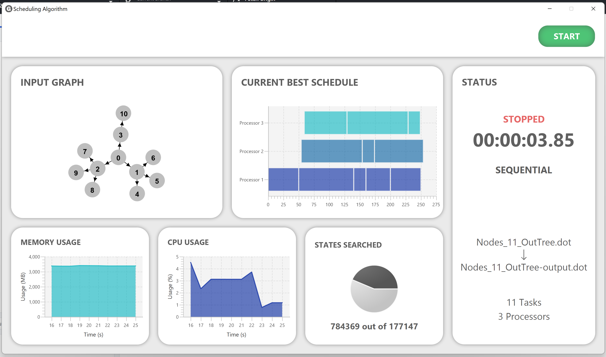

# Visualisation
A visualisation window has been implemented to provide live visual feedback of the search algorithm to the user. This window can 
be enabled by including the `-v` flag when running the algorithm from the command line.

## Solution
The GUI for the interface is displayed as follows:

## Features
The header contains a button to start or stop the scheduler algorithm. The main section of the window consists of six panels 
to group the components. The first is a visualisation of the input graph, displaying a directed acrylic graph (DAG) to 
conceptualise the dot file input. Next to this is a Gantt Chart that shows the current best schedule of the algorithm. 
Below these two panels are graphs illustrating the CPU and memory usage. Also displayed is a pie chart indicating the 
percentage of states searched by the algorithm.
 
Finally, there is a panel that consists of details to provide information on the status of the algorithm as well as 
information on what the algorithm is processing. Features of this panel include the status, the time elapsed and whether 
the algorithm is performing sequential or parallel scheduling. Also included is the input and output file name and counts 
for the number of tasks being scheduled and processors being used.

## Implementation
JavaFX and Scene Builder have been used to create the visualisation. The components are described in the [visualization.fxml](../src/main/resources/visualization.fxml). 
Alongside these, css has been implemented in [visualisation.css](../src/main/resources/visualization.css) for styling when neccessary.

The [Input Graph](../src/main/java/visualisation/InputGraph.java) uses the Graph Visualisation provided by the [GraphStream](https://graphstream-project.org/) 
library. 

To implement the [Gantt Chart](../src/main/java/visualisation/GanttChart.java) an open-source implementation from 
[Stack Overflow](https://stackoverflow.com/questions/27975898/gantt-chart-from-scratch) has been modified and used.

The [VisualisationApplication](../src/main/java/visualisation/VisualizationApplication.java) class has been implemented to extend `javafx.application.Application` 
in order to run the javafx application. 

The [VisualisationController](../src/main/java/visualisation/VisualizationController.java) class includes all the logic 
of the initialising and updating the visualisation window.